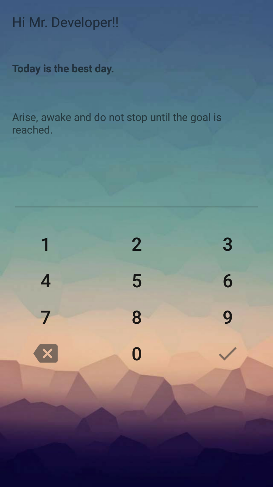
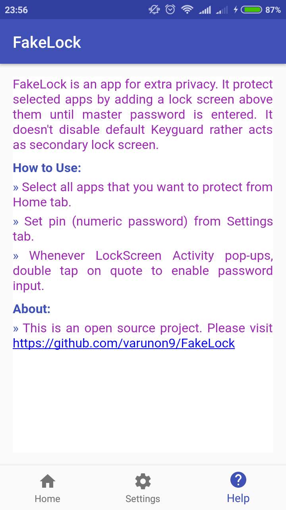

# FakeLock

Custom Android LockScreen app to provide extra layer of privacy. It doesn't disable default Keuguard rather acts as secondary lock screen. 

### Features

* It will protect selected apps by adding a lock screen above them.
* It acts as secondary LockScreen.
* User can still unlock phone by entering random password but protected apps will not be accessible.
* Option to customize lock screen (wallpaper, quote, todo).

### Screenshots:

|  |  |
| --- | --- |
| | |
| | |

### How to contribute?
* Fork this repository.
* This is an Android-Studio project. Download zip and import into Android Studio.
* Fix bugs or make enhancements and create pull requests.

#### Testing of android app:
* Android 4.2.2 Samsung(GT-S7582)
* Android 6.0.1 Redmi 4A

#### For query/issues open Github issue or contact: varunon9@gmail.com

